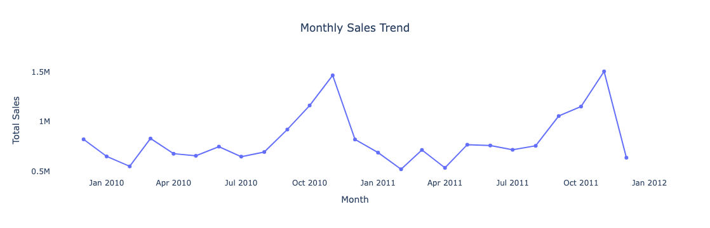
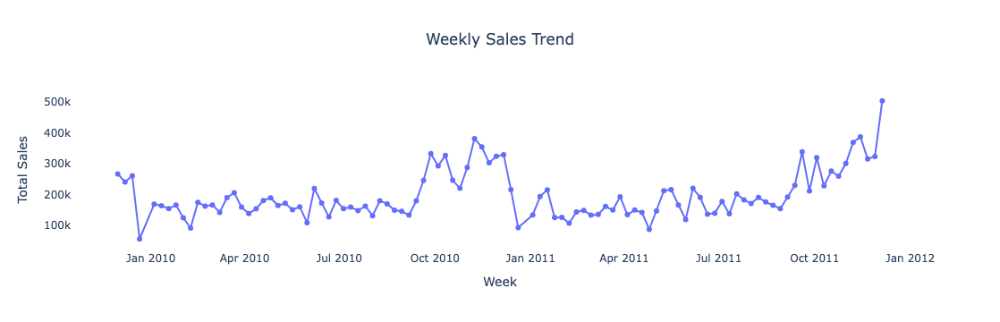
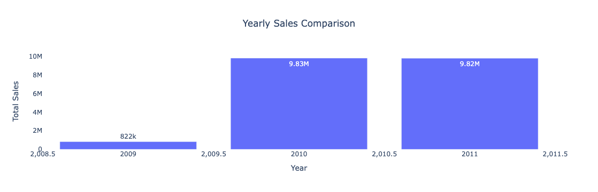
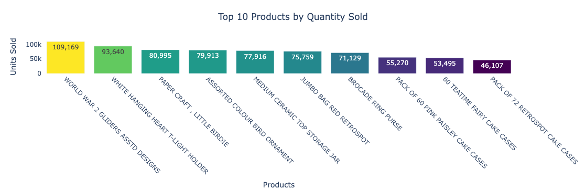
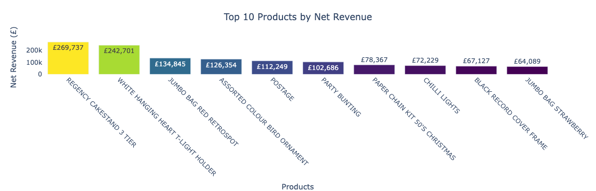
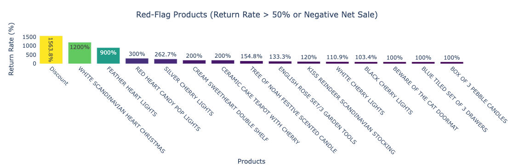
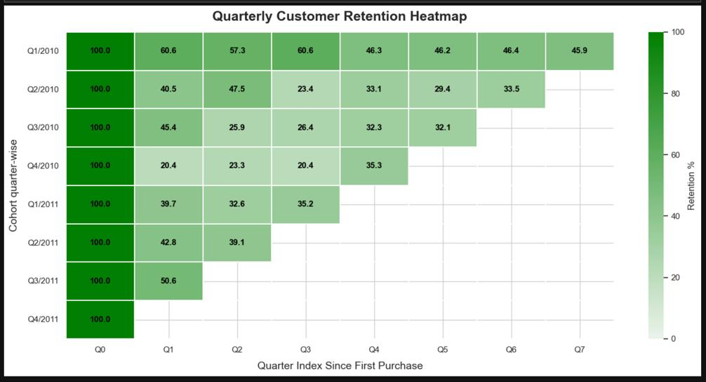
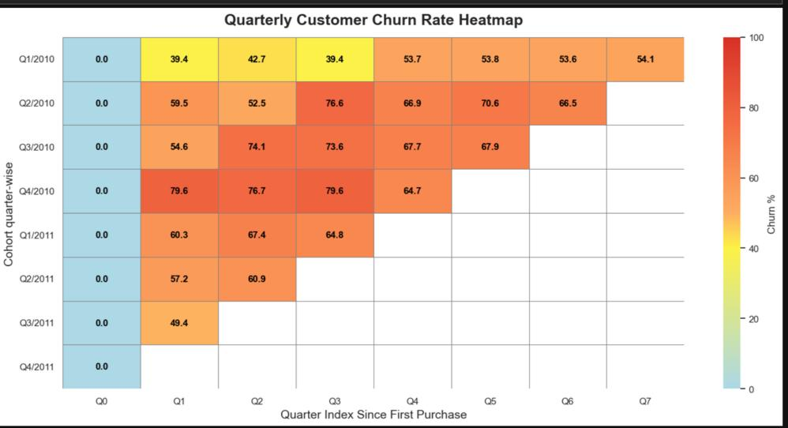
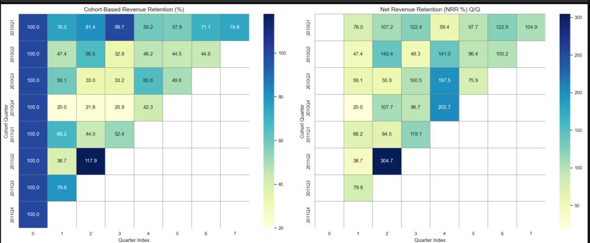
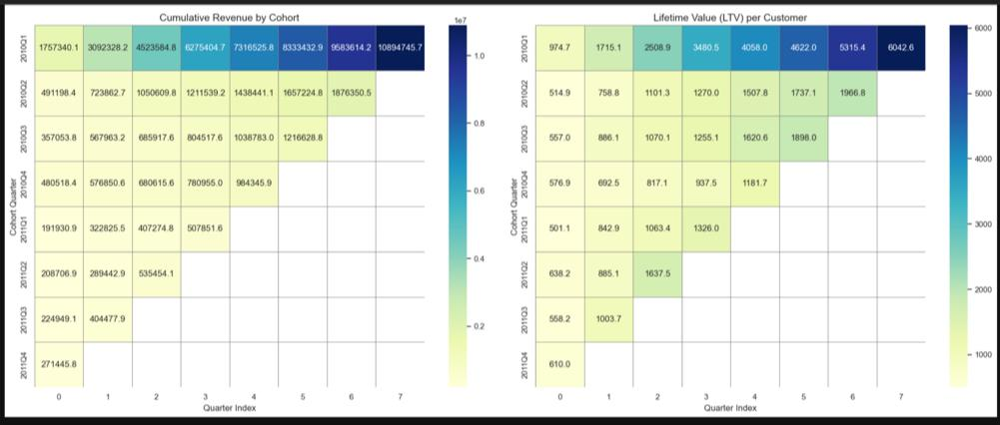

 ## Project Description

ecom-customer-suite is a comprehensive customer and revenue analytics project built using the Online Retail II dataset. The goal is to empower e-commerce businesses with actionable insights on sales performance, customer retention, cohort behavior, and lifetime value—all derived through rigorous data wrangling, exploratory analysis, and advanced segmentation techniques.


---

###  Data Preparation

A strong analytical foundation was established through meticulous data preprocessing. Missing values were addressed, data types corrected, and canceled or erroneous transactions were removed to ensure reliability. By engineering temporal features—such as month, quarter, week, and hour—we enabled fine-grained time-series analysis. This groundwork was critical for revealing seasonal trends, customer behavior patterns, and product dynamics, setting the stage for all downstream business insights.

---

### Sales Analytics and  Trends Analytics

To understand the sales engine of the business, we explored revenue patterns across various time granularities. Trends were visualized on monthly, quarterly, weekly, and even hourly scales, helping pinpoint periods of high and low customer activity. These insights are instrumental for capacity planning, marketing campaign scheduling, and identifying underperforming periods. Knowing when customers are most likely to buy allows businesses to optimize staffing, logistics, and promotional efforts.

---

###  Product-Level  Analysis

The next layer of analysis dove into product dynamics. We identified which items were driving the bulk of sales—and which were lagging. This not only highlights bestsellers for potential bundling and upselling strategies but also flags poor performers that may require reevaluation or promotion. Return and cancellation patterns were also studied, revealing customer dissatisfaction signals or logistical issues. By calculating each product’s average revenue contribution, we provided a profitability lens critical for inventory and pricing strategies.

---

### Customer Cohort Analysis

Understanding how customer behavior evolves over time is key to sustainable growth. By grouping users by their acquisition month, we built cohorts that allowed us to track engagement and retention longitudinally. This revealed how loyal customers are, when they tend to churn, and which acquisition periods led to stronger relationships. Visual cohort heatmaps made it easy to spot which customer groups are consistently returning and which drop off early, enabling better lifecycle marketing and user nurturing strategies.

---

### Quarterly Retention & Churn Rate Analysis

Beyond monthly views, we zoomed out to assess customer retention and churn at a quarterly level. This macro view allowed us to observe long-term loyalty trends and identify inflection points where customers are most likely to disengage. These metrics inform not just retention strategies, but also help in forecasting future revenue and evaluating the effectiveness of past marketing efforts.

---

###  Cohort-Based Revenue Retention

While retention measures customer counts, revenue retention focuses on financial impact. We tracked how much revenue each acquisition cohort generated over time and how that amount decayed. This view is crucial for understanding not just who stays, but **how much they spend**—allowing businesses to invest more in acquisition channels that drive long-term value. Revenue decay curves helped illustrate when monetization efforts start to wane, guiding re-engagement campaigns and personalized outreach.

---

### Net Revenue Retention (NRR) Analysis

Borrowing from SaaS metrics, we applied Net Revenue Retention (NRR) to a retail context to quantify how well the business grows revenue from its existing customer base. By separating revenue into three components—existing revenue, expansion (increased spend), and churn—we gained a nuanced view of revenue health. A high NRR signals strong customer satisfaction and product-market fit, while a declining NRR may indicate emerging issues in retention or product value. This is a core metric for evaluating sustainable growth.

---

### Revenue Segmentation by Customer Cohort

Not all customers contribute equally to the bottom line. By segmenting total revenue by acquisition cohort, we uncovered which customer groups delivered the most financial value over time. This analysis supports targeted campaigns, loyalty programs, and personalized experiences focused on high-performing customer segments. It also helps allocate resources more effectively by investing in channels that bring in valuable, long-term users.

---

###  Customer Lifetime Value (CLV) Estimation

CLV is one of the most important metrics for any customer-centric business. We estimated the total revenue each customer is expected to generate throughout their relationship with the business using average revenue per user and estimated customer lifespan. This allowed us to identify the most valuable customer segments—those worth retaining at all costs—and supported the development of retention programs, tiered loyalty systems, and reactivation workflows. By shifting focus from short-term transactions to long-term relationships, businesses can significantly improve profitability.
###  Dataset

- **Source**: [UCI Online Retail II Dataset](https://archive.ics.uci.edu/ml/datasets/Online+Retail+II)
- **Duration**: December 2009 to December 2011
- **Description**: This dataset contains transactional data from a UK-based online retailer. It includes over 500,000 records of customer purchases, capturing detailed invoice-level data for both domestic and international customers.

#### Key Features:
| Column         | Description                               |
|----------------|-------------------------------------------|
| `InvoiceNo`    | Unique identifier for each transaction     |
| `StockCode`    | Unique product/item code                   |
| `Description`  | Name/description of the product            |
| `Quantity`     | Number of units sold per transaction       |
| `InvoiceDate`  | Date and time of the transaction           |
| `Price`        | Unit price of the product                  |
| `Customer ID`  | Unique ID assigned to each customer        |
| `Country`      | Country of the customer                    |

###  How to Run

1. **Clone the repository**

   ```bash
   git clone https://github.com/Abhi1459/ecom-customer-suite.git
   cd ecom-customer-suite

###  Libraries Used
- pandas
- numpy
- matplotlib
- seaborn
- jupyter
### 📊 Visual Insights

#### 🛍️ Sales Performance
- **Monthly Sales Trend**
  

- **Weekly Sales Trend**
  

- **Yearly Sales Trend**
  

- **Hourly Sales Trend**
  

#### 📦 Product Analysis
- **Top 10 Products by Quantity Sold**
  

- **Top 10 Products by Revenue**
  

- **Products with Highest Cancellations**
  

#### 🌍 Customer & Country Insights
- **Countries with Highest Sales and Returns**
  

- **Customers with Lowest Spending**
  

#### 🔁 Retention & Revenue Metrics
- **Quarterly Customer Retention (Heatmap)**
  

- **Quarterly Churn Rate (Heatmap)**
  

- **Cohort-Based Revenue Retention & NRR**
  

- **Customer Lifetime Value by Cohort**
  


