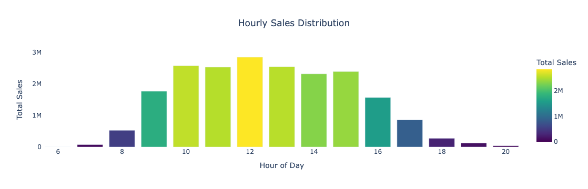

 ## Project Description

ecom-customer-suite is a comprehensive customer and revenue analytics project built using the Online Retail II dataset. The goal is to empower e-commerce businesses with actionable insights on sales performance, customer retention, cohort behavior, and lifetime value—all derived through rigorous data wrangling, exploratory analysis, and advanced segmentation techniques.


---

###  Data Preparation

A strong analytical foundation was established through meticulous data preprocessing. Missing values were addressed, data types corrected, and canceled or erroneous transactions were removed to ensure reliability. By engineering temporal features—such as month, quarter, week, and hour—we enabled fine-grained time-series analysis. This groundwork was critical for revealing seasonal trends, customer behavior patterns, and product dynamics, setting the stage for all downstream business insights.

---

### Sales Analytics and  Trends Analytics

To understand the sales engine of the business, we explored revenue patterns across various time granularities. Trends were visualized on monthly, quarterly, weekly, and even hourly scales, helping pinpoint periods of high and low customer activity. These insights are instrumental for capacity planning, marketing campaign scheduling, and identifying underperforming periods. Knowing when customers are most likely to buy allows businesses to optimize staffing, logistics, and promotional efforts.

---

###  Product-Level  Analysis

The next layer of analysis dove into product dynamics. We identified which items were driving the bulk of sales—and which were lagging. This not only highlights bestsellers for potential bundling and upselling strategies but also flags poor performers that may require reevaluation or promotion. Return and cancellation patterns were also studied, revealing customer dissatisfaction signals or logistical issues. By calculating each product’s average revenue contribution, we provided a profitability lens critical for inventory and pricing strategies.

---

### Customer Cohort Analysis

Understanding how customer behavior evolves over time is key to sustainable growth. By grouping users by their acquisition month, we built cohorts that allowed us to track engagement and retention longitudinally. This revealed how loyal customers are, when they tend to churn, and which acquisition periods led to stronger relationships. Visual cohort heatmaps made it easy to spot which customer groups are consistently returning and which drop off early, enabling better lifecycle marketing and user nurturing strategies.

---

### Quarterly Retention & Churn Rate Analysis

Beyond monthly views, we zoomed out to assess customer retention and churn at a quarterly level. This macro view allowed us to observe long-term loyalty trends and identify inflection points where customers are most likely to disengage. These metrics inform not just retention strategies, but also help in forecasting future revenue and evaluating the effectiveness of past marketing efforts.

---

###  Cohort-Based Revenue Retention

While retention measures customer counts, revenue retention focuses on financial impact. We tracked how much revenue each acquisition cohort generated over time and how that amount decayed. This view is crucial for understanding not just who stays, but **how much they spend**—allowing businesses to invest more in acquisition channels that drive long-term value. Revenue decay curves helped illustrate when monetization efforts start to wane, guiding re-engagement campaigns and personalized outreach.

---

### Net Revenue Retention (NRR) Analysis

Borrowing from SaaS metrics, we applied Net Revenue Retention (NRR) to a retail context to quantify how well the business grows revenue from its existing customer base. By separating revenue into three components—existing revenue, expansion (increased spend), and churn—we gained a nuanced view of revenue health. A high NRR signals strong customer satisfaction and product-market fit, while a declining NRR may indicate emerging issues in retention or product value. This is a core metric for evaluating sustainable growth.

---

### Revenue Segmentation by Customer Cohort

Not all customers contribute equally to the bottom line. By segmenting total revenue by acquisition cohort, we uncovered which customer groups delivered the most financial value over time. This analysis supports targeted campaigns, loyalty programs, and personalized experiences focused on high-performing customer segments. It also helps allocate resources more effectively by investing in channels that bring in valuable, long-term users.

---

###  Customer Lifetime Value (CLV) Estimation

CLV is one of the most important metrics for any customer-centric business. We estimated the total revenue each customer is expected to generate throughout their relationship with the business using average revenue per user and estimated customer lifespan. This allowed us to identify the most valuable customer segments—those worth retaining at all costs—and supported the development of retention programs, tiered loyalty systems, and reactivation workflows. By shifting focus from short-term transactions to long-term relationships, businesses can significantly improve profitability.
###  Dataset

- **Source**: [UCI Online Retail II Dataset](https://archive.ics.uci.edu/ml/datasets/Online+Retail+II)
- **Duration**: December 2009 to December 2011
- **Description**: This dataset contains transactional data from a UK-based online retailer. It includes over 500,000 records of customer purchases, capturing detailed invoice-level data for both domestic and international customers.

#### Key Features:
| Column         | Description                               |
|----------------|-------------------------------------------|
| `InvoiceNo`    | Unique identifier for each transaction     |
| `StockCode`    | Unique product/item code                   |
| `Description`  | Name/description of the product            |
| `Quantity`     | Number of units sold per transaction       |
| `InvoiceDate`  | Date and time of the transaction           |
| `Price`        | Unit price of the product                  |
| `Customer ID`  | Unique ID assigned to each customer        |
| `Country`      | Country of the customer                    |

###  How to Run

1. **Clone the repository**

   ```bash
   git clone https://github.com/Abhi1459/ecom-customer-suite.git
   cd ecom-customer-suite

###  Libraries Used
- pandas
- numpy
- matplotlib
- seaborn
- jupyter
### 📊 Visual Insights

#### 🛍️ Sales Performance
- **Monthly Sales Trend**
  

- **Weekly Sales Trend**
  

- **Yearly Sales Trend**
  

- **Hourly Sales Trend**
  

#### 📦 Product Analysis
- **Top 10 Products by Quantity Sold**
  

- **Top 10 Products by Revenue**
  

- **Products with Highest Cancellations**
  

#### 🌍 Customer & Country Insights
- **Countries with Highest Sales and Returns**
  

- **Customers with Lowest Spending**
  

#### 🔁 Retention & Revenue Metrics
- **Quarterly Customer Retention (Heatmap)**
  

- **Quarterly Churn Rate (Heatmap)**
  

- **Cohort-Based Revenue Retention & NRR**
  

- **Customer Lifetime Value by Cohort**
  

 ##  Deep-Dive into Data Quality, Anomalies & Business Insights

While working on the Online Retail dataset, I realized that meaningful analysis requires more than just cleaning rows and columns. It involves **understanding what the data represents**, and more importantly, how certain patterns or anomalies might affect real-world business decisions.

---

###  Cancelled Orders – Understanding Negative Quantities

One of the first things I noticed was that some invoices began with the letter **'C'**. At first glance, they looked similar to other entries, but on closer inspection, almost all of them had **negative quantities**. When I investigated further, I discovered that these were actually **cancelled orders or customer returns**.

This insight was important — over **90% of the negative quantity rows** in the entire dataset came from these invoices. Including them in sales metrics like total revenue, CLV (Customer Lifetime Value), or retention could completely distort the results. So, I designed my filters to exclude or net them off against actual sales, which gave me much more **realistic business KPIs**.

It was a reminder that not every row of data means money in the bank — context matters.

---

###  Adjusted Bad Debt – The Quiet Distorters

Another unexpected pattern came from invoices labeled as **“A”**. These rows typically had **negative prices**, and often zero quantity. They weren’t returns or refunds — they appeared to be **accounting adjustments** or **financial write-offs** made internally.

From a financial reporting standpoint, these shouldn’t be mixed with genuine transactions. Including them would result in misleading trends — for example, a sudden drop in average selling price, or artificially negative revenue.

To avoid this, I excluded these entries from metrics like **average unit price**, **product profitability**, and **monthly revenue trends**. It reinforced how important it is to ask: *“Is this a real sale, or just a backend adjustment?”*

---

###  Real Sales Invoices – Recognizing Genuine Patterns

Something that helped me separate clean data from noise was a small but consistent pattern: **real sales invoices always started with a number**, typically **4** or **5**. These invoices showed typical retail behavior, such as positive quantities, reasonable prices, and customer details.

This turned into a reliable rule for me. Whenever I was generating dashboards or running customer segmentation, I used this prefix logic to focus only on **authentic sales activity**. It saved a lot of time, especially when performing cohort or churn analysis, where including false positives (like returns or bad debt entries) would’ve led to incorrect insights.

---

###  Outliers in Product Pricing – The Strange and the Surprising

While analyzing pricing patterns, I discovered a few interesting outliers that taught me a lot about product-level behavior.

#### The Most Expensive Product

One product titled `'Manual'` stood out immediately. It was priced at a staggering **£38,970.00**, with a quantity of **-1**. There were no other transactions for this product.

At first, I thought this might be a premium item — but a deeper look suggested it could be a **manual data entry error**, a placeholder, or maybe a test case someone forgot to remove.

Rather than removing it blindly, I flagged it as a **data anomaly** and kept it excluded from all financial calculations. This ensured that one odd entry didn’t distort metrics like highest product revenue or average order value.

####  The Cheapest Product

On the other end of the spectrum was a product called `'PADS TO MATCH ALL CUSHIONS'`, priced at just **£0.001 per unit**. Effectively, you could get 100 items for a penny.

This clearly wasn’t intended to generate profit. It seemed like a **giveaway item**, part of a bundle, or something used for marketing purposes.

Again, I didn’t delete it — but I marked it as a **non-revenue driver**. That way, my pricing and profitability analysis remained clean, while still acknowledging the presence of low-value items that may play a role in customer experience or packaging strategy.

---

###  Largest Order – A Closer Look at Bulk Buyers

When reviewing the highest-value transactions, one sale stood out:

- **Product**: `PAPER CRAFT , LITTLE BIRDIE`  
- **Quantity**: 80,995 units  
- **Unit Price**: £2.08  
- **Total Order Value**: **£168,467.60**  
- **Customer ID**: 16446  
- **Invoice Date**: December 9, 2011

This was no ordinary purchase — it was likely made by a **corporate buyer, wholesaler, or reseller**, especially considering the size and timing (just before the holiday season).

From a business angle, this highlighted that the platform wasn’t only catering to B2C customers. These kinds of buyers have a huge impact on revenue and fulfillment, and I made sure to **segment them separately** from regular customers during my CLV and retention analysis. Treating them the same would’ve distorted per-customer averages and skewed trends unfairly.


By spending time understanding not just what was wrong, but **why** it looked that way, I was able to:

- Build stronger logic for identifying valid sales.
- Make smarter decisions on what to include or exclude in KPIs.
- Extract deeper business meaning from what at first seemed like “bad data”.


  
  ##  Sales Performance & Customer Behavior Insights

When analyzing the core sales metrics, I aimed to preserve **the full picture** of revenue and behavior. Rather than removing rows with missing `CustomerID`, I retained them to reflect all transactions — especially one-time purchases or guest checkouts — as they still contribute to **gross revenue**.

---

### Country-Level Sales Overview

- The **United Kingdom** was the dominant market by a large margin, generating approximately **£17.4 million** in gross revenue.
- It was followed by **Ireland (£660k)** and **the Netherlands (£550k)**.
- These three countries together contributed the majority of the platform’s revenue, with the UK clearly being the home base or primary market.

Sales and marketing strategies are likely UK-centric. However, secondary regions like Ireland and the Netherlands show promising scale and could be worth targeting for growth campaigns.

---

### Cancelled Orders by Country

- As expected, the UK also saw the highest **cancelled order value**, since it had the most transactions overall.
- Cancellations totaled:
  - **UK**: Highest (unspecified amount)
  - **Ireland**: **£49k**
  - **France**: **£28k**
  
High cancellation rates in top countries like Ireland and France may indicate issues like **product return policies**, **logistics inefficiencies**, or **customer dissatisfaction** in cross-border delivery. These regions may benefit from improved fulfillment or customer service initiatives.

---

### Top Spending Customers

Two customers stood out due to their exceptionally high lifetime value:

- **Customer 18102**: Total spend ~**£580,000**
- **Customer 14156**: Total spend ~**£525,000**
  
These are likely **resellers or wholesale buyers**. Such customers have a major impact on revenue and should be prioritized in **VIP customer segmentation**, **retention strategies**, or even **personalized fulfillment models**.

---

###  Customers with the Most Cancelled Orders

Some customers had unusually high **negative revenue** due to returns or cancellations:

- **Customer 12918**: Total cancelled orders ~**-£25,000**
- **Customer 15760**: Total cancelled orders ~**-£11,500**
 
These users may be **at-risk or problematic accounts**, either due to high dissatisfaction, operational errors, or gaming return policies. It’s important to monitor such patterns to maintain margin integrity and prevent operational abuse.

---

###  Final Takeaway

This sales analysis wasn't just about measuring how much was sold — it was about understanding **where**, **to whom**, and **how consistently**. By tracking both top performers and red flags, I was able to generate a well-rounded picture of commercial performance, which informed subsequent work on customer segmentation and lifetime value modeling.

##  Product-Level Analysis: What’s Driving Sales, What’s Hurting Margins

As part of my deep dive into sales patterns, I looked beyond just “which products sold the most” and focused on **unit volumes, revenue contribution, return behavior**, and **overall customer satisfaction**.

---

###  Top Revenue Contributors

When I aggregated revenue at the product level, a few clear front-runners emerged:

- **REGENCY CAKESTAND 3 TIER** topped the chart with around **£267,000 in revenue**, which alone made up nearly **1.4%** of total sales.
- **WHITE HANGING HEART T-LIGHT HOLDER** was close behind at **£242,000**, proving itself both high-volume and high-impact.
- **JUMBO BAG RETROSPOT** followed with approximately **£134,000** — a relatively inexpensive product that scaled through volume.

 **What this tells me**: These products are the company’s breadwinners. Their consistent demand and strong margins make them ideal for promotional focus and inventory priority.

---

###  Best-Sellers by Quantity (Not Just Revenue)

I also ranked products by how many units they sold — not just how much money they brought in. Sometimes low-priced items punch above their weight:

- **WORLD WAR 2 GLIDERS ASST**: over **109,000 units sold**
- **WHITE HANGING HEART T-LIGHT HOLDER**: over **93,000 units**

 **What stood out**: These items have clear product-market fit. Their popularity isn't just about price — they’re likely impulse buys or strong in seasonal appeal.

---

###  Products That Hurt More Than They Help

I flagged products where **more than 50% of the sold units were returned**, and where net revenue was negative — a clear red flag. These included:

- **WHITE SCANDINAVIAN HEART CHRISTMAS**
- **FEATHER HEART LIGHTS**
- **SILVERY CHERRY LIGHTS**

 **My takeaway**: These products need attention — either from a **quality control** or **expectation management** point of view. High return rates suggest they’re costing more than they earn.

---

###  Overall Sales Patterns

Some broader patterns I found helpful in profiling product performance:

- **Average units sold per SKU**: ~2,029  
- **Top 25% of products** sold more than **1,857 units**, showing a healthy cluster of consistently performing SKUs.

 **Implication**: There’s a solid group of products driving stable sales. This supports focused restocking and SKU prioritization rather than spreading inventory thin across hundreds of items.

---

###  Return Rates & Customer Satisfaction

I calculated product-level return rates and acceptance:

- **Median return rate** across all SKUs was just **0.28%**  
- **Median acceptance rate** came out to **99.71%**

💡 **Why this matters**: It shows that for the vast majority of products, customers are happy — suggesting strong supplier relationships, quality control, and clear product descriptions.

---

###  After-Return Revenue Superstars

Even after accounting for returns, some SKUs still generated **net sales over £269,000**. These are the real drivers of profitability.

💡 **Next Steps**: These SKUs should be regularly promoted, and their inventory cycles should be optimized. Their performance is strong enough to anchor broader sales strategies.

---

### Final Thoughts

Doing this kind of product-level analysis helped me go beyond just “what sold the most.” I was able to identify **profitable patterns**, **products worth promoting**, and **areas of loss that deserve attention**. It’s the kind of insight that not only boosts KPIs like AOV and CLV — but also helps avoid margin erosion over time.

## Sales Trend Analysis: Seasonal Surges & Customer Behavior

To understand how sales evolved over time, I started by analyzing monthly and quarterly trends across the dataset. One clear seasonal pattern emerged: sales were relatively steady through most months, but consistently **spiked in Q4 (October to December)**. This is especially pronounced in both 2010 and 2011, and strongly aligns with the **holiday shopping season** — a critical period for most e-commerce businesses.

The Q4 peak wasn't just a one-time event. It repeated across both years, which makes it a reliable pattern rather than an anomaly. Post-December, there’s a noticeable drop in sales — a slump that’s common in retail after major shopping periods like Christmas. This drop-off helps validate the idea that much of the customer activity is tied to seasonal events or gifting trends.

Looking at the data by hour of the day, I found something equally interesting. Customer activity starts picking up around **9:00 AM** and stays active until about **4:00 PM**. This suggests most purchases are made during standard working hours, possibly indicating that customers shop during breaks or from their workplace devices. There’s significantly less traffic late at night or in the early morning hours, showing a typical business-hour engagement window.

Understanding these timing patterns is more than just reporting — it provides actionable insight. For instance, if I were to recommend ad campaigns or flash sale timings, I’d schedule them to align with those active morning-to-afternoon windows. Similarly, inventory planning should prioritize Q4 build-up, with warehouse and logistics teams ramping up capacity well before October.

Overall, these trends confirm that **seasonality and time-of-day behavior** are two of the most important levers in this business. Ignoring them could mean missed revenue opportunities — but using them well can unlock significant growth.

##  Cohort Analysis: Retention Trends, Churn Signals & Strategic Levers for Growth

Cohort analysis offered some of the most valuable insights into the long-term health of the business. By segmenting customers based on their first purchase quarter and tracking their return behavior, I was able to uncover both weaknesses in past performance and improvements that likely resulted from strategic action.

One of the first trends that stood out was a **clear improvement in quarterly retention during 2011**. Customers acquired in early 2011 were significantly more likely to return in subsequent quarters compared to those from 2010. This points to a pivotal shift — something changed operationally or strategically that positively impacted customer loyalty. Whether it was better user experience, smarter post-purchase engagement, or more reliable delivery, the data suggests that **the business learned from early churn and corrected course effectively**.

Interestingly, the **Q1/2010 cohort maintained relatively high retention over multiple quarters**, suggesting that these were early high-value customers — perhaps loyal brand adopters, repeat buyers, or even B2B clients. Their continued engagement highlights the value of building strong relationships from the very first interaction.

However, not all cohorts performed equally. The **churn rate in Q4/2010 was alarmingly high — over 70% of those customers never returned**. This quarter coincides with the holiday season, which typically brings in a wave of first-time or gift-driven shoppers. The fact that such a large portion failed to convert into repeat buyers represents a **major leakage of potential long-term value**. It’s likely that the post-purchase experience — such as fulfillment delays, product quality gaps, or weak retention messaging — didn’t meet expectations.

What’s encouraging is that **churn rates improved dramatically after that quarter**, and this improvement continued throughout 2011. In fact, **2011 showed far better retention curves across the board**, indicating that the business likely acted on insights from the 2010 churn spike. This kind of responsiveness is critical for survival in e-commerce — where acquisition is costly, and every retained customer improves marketing ROI and long-term profitability.

From a macroeconomic standpoint, these cohort patterns carry meaningful implications. E-commerce isn’t just about single transactions — it thrives on relationships. A customer retained is not only more likely to repurchase, but also to influence others, reduce support costs, and create forecasting stability. **Lower churn strengthens cash flow, improves inventory efficiency, and builds brand equity** — all vital for businesses operating in uncertain or competitive economic environments.

In conclusion, this cohort analysis didn’t just measure behavior — it highlighted how **strategic customer retention is a lever for compounding growth**. Retention metrics, when properly analyzed, serve as an early warning system for business health and a guidepost for long-term planning. This analysis showed that the e-commerce platform recognized churn, acted decisively, and ultimately benefited from improved loyalty — a case study in how data can inform and drive meaningful change.

 
##  Customer Cohort & Revenue Analysis — Business Intelligence Suite

This dashboard was built to uncover deep behavioral patterns in e-commerce customers using techniques like **cohort analysis**, **revenue retention tracking**, and **lifetime value modeling**. The goal was not just to visualize trends but to diagnose **which types of customers drive growth**, **where retention is breaking down**, and **how the business can scale profitably**.

---

###  Cumulative Revenue by Customer Cohort

This view tracks total revenue earned from each customer cohort (grouped by acquisition quarter) over time.

The Q1 2010 cohort stood out by generating over **₹10.8 million**, outperforming all others. Their strong long-term contribution suggests a winning combination of onboarding, product fit, or acquisition strategy at the time.

Cohorts from 2011 onwards show faster revenue decay — possibly due to weaker targeting, poorer first-time experience, or market saturation. These shifts should be reviewed closely to inform future acquisition and retention strategies.

Earlier cohorts also demonstrate extended revenue tails, meaning customers stuck around and kept spending across multiple quarters. This type of retention is the backbone of healthy LTV growth.

---

###  Lifetime Value (LTV) per Customer

LTV analysis revealed how much each customer is worth over time, on average, for each cohort.

The Q1 2010 cohort’s average LTV grew sixfold—from **₹974.7 to ₹6,042.6**, indicating not just retention, but effective upselling or improved customer satisfaction.

Cohorts post-Q2 2010 saw flatter LTV curves—an early signal that customer engagement dropped. These users made initial purchases but failed to develop into high-value customers.

This insight is critical for CRM planning. By improving the **early lifecycle journey**, the business can influence customer lifetime value directly.

---

###  Revenue Retention (%) Over Time

This analysis measured how much of the initial revenue from each cohort was retained quarter-over-quarter.

High-performing cohorts like Q1 2010 retained 70–80% of their revenue over time — a sign of strong customer relationships and continued value delivery.

In contrast, cohorts from Q4 2010 onwards lost nearly half their revenue within two quarters — likely due to drop-offs in repeat purchases, poor post-purchase engagement, or rising competition.

A few sharp spikes (e.g., 117.9% in Q2 2011) suggest campaigns that temporarily boosted revenue but lacked staying power. Sustainable retention is more valuable than short-lived surges.

---

### Net Revenue Retention (NRR %) — Growth from Existing Users

Net Revenue Retention looks at how much revenue is retained (and grown) from existing users, factoring in churn and upsell.

Early cohorts like Q1 2010 consistently hit **NRR > 100%**, which is rare and valuable — indicating users who spend more over time.

The **Q2 2011 cohort spiked to 304.7%**, likely driven by a one-time promotion or enterprise-level purchase. However, it didn’t repeat in other cohorts, implying a non-repeatable tactic.

Cohorts with **NRR < 60%** show weak monetization of acquired customers and may reflect over-investment in marketing without retention follow-through.

---

###  Strategic Insights & Business Takeaways

The data tells a clear story:

 **Early customer cohorts (esp. 2010)** were retained better, spent more, and contributed long-term value. These users had better onboarding, stronger product alignment, or better overall CX.

 **2011 cohorts deteriorated across all KPIs**, especially in LTV and retention. This is a red flag for acquisition or lifecycle strategies — possibly a shift in targeting, user expectations, or competition.

**Strong NRR and LTV in early cohorts** suggest there's still untapped opportunity to **scale revenue through better retention, upsell, and reactivation**—especially if newer users can be brought to the same value trajectory.

Strategic levers like **A/B testing onboarding**, **early lifecycle nudges**, **customer segmentation**, and **churn modeling** can help lift CLV and optimize CAC-to-LTV ratios.

 In a tough e-commerce landscape, customer relationships are assets. This analysis shows how the business can move from transactional sales to long-term profitability by listening to cohort behavior—and acting on it.

---

**All insights were derived from rigorous cohort and revenue modeling built on clean, pre-processed transactional data, visualized via Python dashboards.*

 


